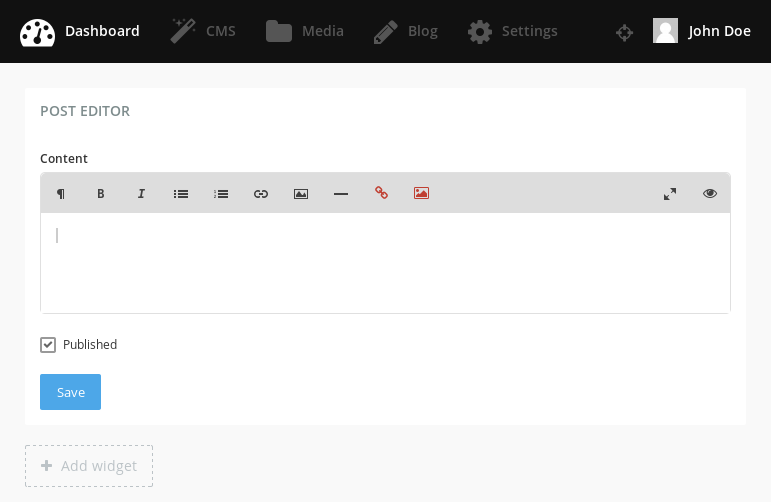
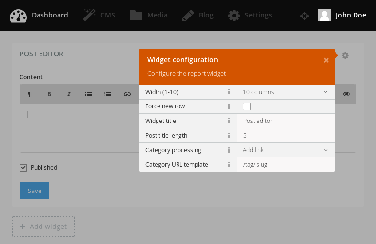

# Microblog

A plugin for [October CMS](http://octobercms.com/) that provides the backend widget for a fast publishing of posts.

## Features

* the widget for the dashboard (you can create a post right after login to the backend);
* the automatic creation of a post title;
* the automatic creation of categories.

### Post title

The plugin supports the automatic creation of a post title. The post title is composed of the first few words of the post and a ellipsis. A word is a sequence of letters, digits and hyphens. The exact number of words in the post title is regulated (`Post title length` property of the widget).

### Categories

The plugin supports the automatic creation of categories. For this categories marks should be placed in the text of the post. A category mark consists of the `@` sign and the name of the category, for example: `@example`.

The plugin has four types of the processing of categories marks (`Category processing` property of the widget):

* `None` &mdash; categories aren't created and marks aren't change;
* `Remove` &mdash; categories are created, the post added to these categories and marks are removed;
* `Save name` &mdash; categories are created, the post added to these categories and marks are transformed to categories names (removed the `@` sign);
* `Add link` &mdash; categories are created, the post added to these categories and marks are transformed to links to categories pages.

The link to the category page is created on the basis of the specified template (`Category URL template` property of the widget). This template must contain the `:mark` mark. It will be replaced by the category slug. The example of the template: `/tag/:slug`.

## Available widgets

### PostEditor

The widget has the following properties:

* `Post title length` &mdash; the length of the post title in words (default value: `5`);
* `Category processing` &mdash; the type of the processing of categories marks (default value: `Add link`);
* `Category URL template` &mdash; the template of the link to the category page (default value: `/tag/:slug`).

## Available languages

* en &mdash; English;
* ru &mdash; Russian.

## Requirements

* [RainLab Blog](http://octobercms.com/plugin/rainlab-blog) plugin.

## Screenshots

Post editor:

Widget configuration:

## License

The MIT License (MIT)

Copyright &copy; 2016 thewizardplusplus <thewizardplusplus@yandex.ru>
